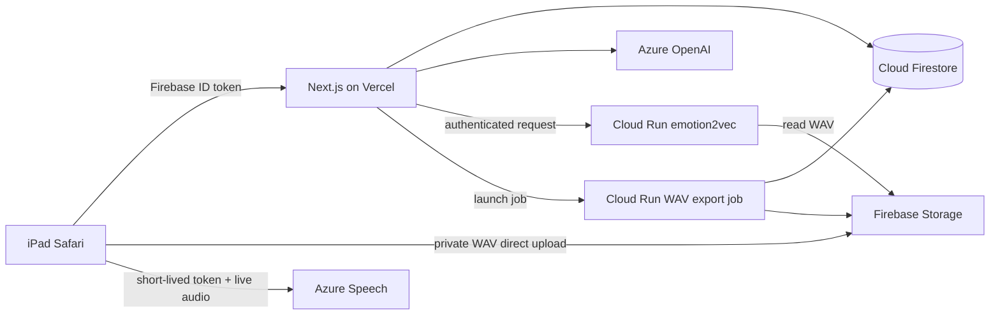

# 系統架構與資料契約

## 請求路徑



WAV 不經過 Vercel Function。瀏覽器先取得嘗試與唯一 Storage 路徑，直接上傳成功後才呼叫分析 API；`attemptId` 是所有完成請求的冪等鍵。

## 學生狀態機

每一節點依序執行情節輪與感受輪：

```text
active/plot
  ├─ technical_error ────────────────> active/plot（不計次）
  ├─ failed attempt 1–2 ─────────────> active/plot（+1）
  ├─ passed ─────────────────────────> active/feeling
  └─ failed attempt 3 ───────────────> active/feeling（forced_advance）

active/feeling
  ├─ technical_error ────────────────> active/feeling（不計次）
  ├─ failed attempt 1–2 ─────────────> active/feeling（+1）
  └─ passed / forced_advance ────────> awaiting_confirmation
                                         ├─ retry → active/feeling
                                         └─ confirm → next plot / completed
```

判定順序固定在 `lib/study/evaluator.ts`，模型只提供結構化證據，不能自行決定流程。情節輪通過條件是至少一個節點事實；感受輪是可理解的感受表達。兩輪均需至少八個有效英文詞與 Accuracy／Fluency 60 分。

Agent 2 另外要求目標情緒在 emotion2vec 前二名且分數至少 0.30，Azure 不得回傳 Monotone。Agent 1 不送出 emotion2vec 請求。

## API

| 路徑 | 方法 | 用途 |
|---|---|---|
| `/api/session` | POST | 建立或恢復鎖定版本的場次 |
| `/api/speech/token` | POST | 取得約九分鐘的 Azure Speech token |
| `/api/attempts` | POST | 建立嘗試及私人 WAV 路徑 |
| `/api/attempts/:id/complete` | POST | 驗證上傳、分析並冪等提交 |
| `/api/worksheet/confirm` | POST | 確認日記卡片 |
| `/api/worksheet/retry` | POST | 重新開啟感受輪 |
| `/api/admin/overview` | GET | 後台聚合資料 |
| `/api/admin/sessions/:id` | GET | 場次、嘗試、訊息、日記與註記 |
| `/api/admin/sessions/:id/notes` | POST | 新增不可覆寫原始資料的註記 |
| `/api/admin/audio` | GET/DELETE | 五分鐘播放連結／具稽核刪除 |
| `/api/admin/participants/import` | POST | 批次建立或重設帳號 |
| `/api/admin/config/vocabulary` | GET/POST | 查詢／發布不可變詞表 |
| `/api/admin/export` | POST/GET | 建立資料匯出／查詢 WAV ZIP |

所有正式 API 都驗證 Firebase ID token。研究者 API 另查驗 `participants/{uid}.role == "researcher"`，不信任前端選擇的角色。

## Firestore

- `participants`：研究代碼、班級、角色、同意版本、永久組別。
- `classes`：可變區塊分派佇列及已分派數量。
- `sessions`：目前節點、輪次、嘗試、狀態及固定設定版本。
- `sessions/{id}/attempts`：WAV 路徑、逐字稿、Azure 原始值、模型證據、判定、錯誤與時間。
- `sessions/{id}/messages`：學生／系統泡泡與 `templateId`。
- `sessions/{id}/researchNotes`：研究註記；不改寫嘗試。
- `worksheets/{sessionId}/entries`：五節點日記與來源嘗試。
- `studyConfigs`、`studyMetadata`：設定與不可變詞表版本。
- `auditLogs`、`exports`：敏感操作及匯出狀態。

瀏覽器對 Firestore 一律拒絕；Next.js 使用 Admin SDK 寫入。Storage 只允許登入學生建立自己的 `audio/{uid}/{sessionId}/*.wav`，並檢查 WAV MIME 與 2 MB 限制；讀取、覆寫、刪除均拒絕。

## 失敗與恢復

停止錄音後先把完整待辦寫入 IndexedDB。只有 Storage 與完成 API 都成功，才刪除待辦並允許學生前進。重新整理或斷線後，學生頁會載入 Firestore 狀態，並每十秒以原 `attemptId` 重試 IndexedDB 工作。

Azure Speech、Azure OpenAI 或 emotion2vec 失敗會形成 `technical_error`，保存錯誤但不增加有效嘗試次數。正式環境的日誌不得另行輸出逐字稿、提示、音檔 URL 或金鑰。
